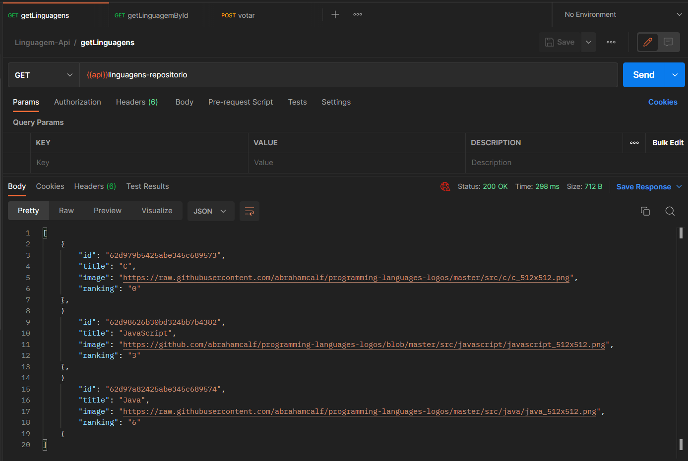

# Alura: Imersão Java - API

Esse é o repositório com os fontes desenvolvidos na aula 04. Toda a documentação pode 
ser encontrada em:

[REPOSITÓRIO PRINCIPAL](https://github.com/Ro-Goncalves/alura-imersao)

<h2> Documentação Da API </h2>

**ENDPOINT:** https://frozen-escarpment-49782.herokuapp.com

**LINK COLLECTION POSTMAN:** https://www.getpostman.com/collections/1158eff13b9a538b4e97

**SERVIÇOS**

Buscar todas as linguagens: GET /linguagens-repositorio.

Buscar linguagem por id: GET /linguagens-repositorio/{id}.

Votar: POST /linguagem-repositorio/votar

